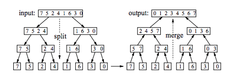

# Merge Sort

- Java Arrays.sort() uses mergesort or a tuned quicksort depending on data type.
- Insertion sort is used for arrays with fewer than 7 elements.

A divide-and-conquer approach:
- Divide (the problem into a small number of pieces),
- Conquer (solve each piece, by applying divide-and-conquer *recursively* to it), and
- Combine (the pieces together into a global solution).

How can we apply divide-and-conquer to sorting?
- Divide: Split A down the middle into two subsequences, each of size roughly n/2.
- Conquer: Sort each subsequence (by calling MergeSort recursively on each).
- Combine: Merge the two sorted subsequences into a single sorted list.

## How It Works

#### Static Image


#### Animation


### Splitting
Recursive, so:
- pass in the array, the index of the start of the sub-array, the index of the end of the sub-array
- (1)if the start and end index of the sub array are the same, then we have an array of one element, and we don't need to sort it
- if end > start, we need to split the array and use divide-and-conquer
  - find the halfway point between start and end
  - split the array in half
  - repeat from (1)
- CARE: splitting the array needs to be done as
  - first_half = start..midway
  - second_half = midway+1..end
  - *because* if the array has only two elements, going back by one will mean you end up with an empty array (or in Ruby, the last element of the array), and an array of two
- then merge the arrays (see explanation below)

#### Pseudocode

```JAVA
MergeSort(array A, int p, int r) {
  if (p < r) { // we have at least 2 items
    q = (p + r)/2
    MergeSort(A, p, q) // sort A[p..q]
    MergeSort(A, q+1, r) // sort A[q+1..r]
    Merge(A, p, q, r) // merge everything together
  }
}
```

### Merging
Merge(A, start, midway, end) assumes that the left subarray, A[start..midway], and the right subarray, A[midway + 1..end], have already been sorted.
- while we are merging, we will copy the elements of the left and right subarrays to a temporary working array as follows:
  - looking at the first element of each subarray, put the smaller of the two in temp[0] and look at the next element in that array
  - compare that to the first element in the other array, and put the smaller of the two in temp[1], and look at the next element in that array
  - and repeat until one of the sub-arrays is empty
- then copy the remainder of the other sub-array into temp
- copy the contents of temp back into the orginal unsorted array

#### Pseudocode

```JAVA  
procedure merge( Array a, Array b )

   Array c // temp array

   while ( a and b have elements )
      if ( a[0] > b[0] )
         add b[0] to the end of c
         remove b[0] from b
      else
         add a[0] to the end of c
         remove a[0] from a
      end
   end

   while ( a has elements )
      add a[0] to the end of c
      remove a[0] from a
   end

   while ( b has elements )
      add b[0] to the end of c
      remove b[0] from b
   end

   return c

end
```

## Run time complexity
O(n log n)

## Comparison to other sort algorithms
- **quicksort** generally outperforms mergesort on modern architectures where data is in RAM
- **quicksort** worst case is worse than mergesort
- **heapsort** uses less memory, and has a faster best case scenario, but is overall slower in most cases
- mergesort is better for data on slow-to-access media e.g. magnetic tape
- mergesort is often best for a linked list because the data is slow to access
- standard search algorithms are often a hybrid of mergesort and **insertion sort**
- mergesort is regarded as a **stable** sort (go on, google it)


## Implementation

### Ruby
```RUBY
def mergesort(list)
  return list if list.size <= 1
  mid   = list.size / 2
  left  = list[0...mid]
  right = list[mid...list.size]
  merge(mergesort(left), mergesort(right))
end

def merge(left, right)
  sorted = []
  until left.empty? || right.empty?
    if left.first <= right.first
      sorted << left.shift
    else
      sorted << right.shift
    end
  end
  sorted.concat(left).concat(right)
end
```

### Java
```JAVA
public class Mergesort {
    private int[] numbers;
    private int[] helper;

    private int number;

    public void sort(int[] values) {
        this.numbers = values;
        number = values.length;
        this.helper = new int[number];
        mergesort(0, number - 1);
    }

    private void mergesort(int low, int high) {
        // check if low is smaller than high, if not then the array is sorted
        if (low < high) {
            // Get the index of the element which is in the middle
            int middle = low + (high - low) / 2;
            // Sort the left side of the array
            mergesort(low, middle);
            // Sort the right side of the array
            mergesort(middle + 1, high);
            // Combine them both
            merge(low, middle, high);
        }
    }

    private void merge(int low, int middle, int high) {

        // Copy both parts into the helper array
        for (int i = low; i <= high; i++) {
            helper[i] = numbers[i];
        }

        int i = low;
        int j = middle + 1;
        int k = low;
        // Copy the smallest values from either the left or the right side back
        // to the original array
        while (i <= middle && j <= high) {
            if (helper[i] <= helper[j]) {
                numbers[k] = helper[i];
                i++;
            } else {
                numbers[k] = helper[j];
                j++;
            }
            k++;
        }
        // Copy the rest of the left side of the array into the target array
        while (i <= middle) {
            numbers[k] = helper[i];
            k++;
            i++;
        }
        // Since we are sorting in-place any leftover elements from the right side
        // are already at the right position.

    }
}
```
### Java Test Code
```JAVA
import static org.junit.Assert.assertTrue;
import static org.junit.Assert.fail;

import java.util.Arrays;
import java.util.Random;

import org.junit.Before;
import org.junit.Test;

public class MergesortTest {

    private int[] numbers;
    private final static int SIZE = 7;
    private final static int MAX = 20;

    @Before
    public void setUp() throws Exception {
        numbers = new int[SIZE];
        Random generator = new Random();
        for (int i = 0; i < numbers.length; i++) {
            numbers[i] = generator.nextInt(MAX);
        }
    }

    @Test
    public void testMergeSort() {
        long startTime = System.currentTimeMillis();

        Mergesort sorter = new Mergesort();
        sorter.sort(numbers);

        long stopTime = System.currentTimeMillis();
        long elapsedTime = stopTime - startTime;
        System.out.println("Mergesort " + elapsedTime);

        for (int i = 0; i < numbers.length - 1; i++) {
            if (numbers[i] > numbers[i + 1]) {
                fail("Should not happen");
            }
        }
        assertTrue(true);

    }

    @Test
    public void itWorksRepeatably() {
        for (int i = 0; i < 200; i++) {
            numbers = new int[SIZE];
            Random generator = new Random();
            for (int a = 0; a < numbers.length; a++) {
                numbers[a] = generator.nextInt(MAX);
            }
            Mergesort sorter = new Mergesort();
            sorter.sort(numbers);
            for (int j = 0; j < numbers.length - 1; j++) {
                if (numbers[j] > numbers[j + 1]) {
                    fail("Should not happen");
                }
            }
            assertTrue(true);
        }
    }

    @Test
    public void testStandardSort() {
        long startTime = System.currentTimeMillis();
        Arrays.sort(numbers);
        long stopTime = System.currentTimeMillis();
        long elapsedTime = stopTime - startTime;
        System.out.println("Standard Java sort " + elapsedTime);

        for (int i = 0; i < numbers.length - 1; i++) {
            if (numbers[i] > numbers[i + 1]) {
                fail("Should not happen");
            }
        }
        assertTrue(true);
    }

}
```
